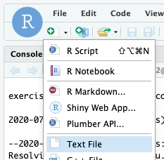

# Command line essentials for Bioinformatians

This website is a companion reference for the corresponding [BCC2020 conference session](https://sched.co/c7Sz). 

This workshop is designed for students who already have a basic familiarity with running programs and navigating the filesystem in a unix shell.  It aims to refresh some of that basic knowledge and then build upon it to demonstrate powerful features of the shell that can be used to speed up common bioinformatics tasks.

## Setup

#### If you are a BCC2020 workshop participant

All the files you need to run the exercises should already be setup in your user account on [rstudio.bioinformatics.guide](https://rstudio.bioinformatics.guide)

1. Log in to the workshop server using the credentials provided by your instructor.  
The workshop server is available at [rstudio.bioinformatics.guide](https://rstudio.bioinformatics.guide)
2. The server is running rstudio but for this workshop we will just use the `Terminal` feature provided by rstudio.  Click `Tools` -> `Terminal` -> `New Terminal`.  

#### If you want to run the exercises on your own computer

1. Open a Terminal window on your computer. 
2. Create a directory for workshop materials
```bash
mkdir bcc2020cle
```
3. Download and run the setup script
```bash
cd bcc2020cle
wget -L https://raw.githubusercontent.com/iracooke/bcc2020CLE/master/setup.sh
bash setup.sh
```

## Introduction

Start with [this presentation](https://rpubs.com/iracooke/bcc2020cle) which outlines why command line skills are important and runs through the key features of the Bash shell.

## Exercise 1

This exercise picks up from the last point in the introductory presentation (see above).  It explores methods for automating repetitive tasks.  

Our analysis goal in this exercise is to map paired end Illumina reads from an RNA sequencing run onto a de-novo assembled transcriptome.  There are 12 samples and we need to align each of them. We will then run some summary stats on the aligned reads. 

Change directory into the `exercise_1` folder and then use `ls` to display the files present
```bash
cd bcc2020cle/exercise_1
```

```bash
ls
```

**Inputs**
- A reference transcriptome file `H_mac_transcripts_codingseq.fasta`
- Remote URLs for downloading the 12 samples. 

#### 01 downloading samples

Use the `rstudio` interface to create a new text file inside the `exercise_1` directory. Name your new file `01_download.sh`


Copy the following code into your script.  This code comes from the last few slides of the introductory presentation

```bash
base_url="https://s3-ap-southeast-2.amazonaws.com/bc3203/EM_10k/"
for sample_num in $(seq 1 2)
do
  for r in R1 R2
    do
    echo "${base_url}EM${sample_num}_${r}.fastq.gz"
  done
done
```

Now try running the script
```bash
bash 01_download.sh
```

The script emits four URLs corresponding to 2 samples.

Now try downloading the first URL using the `wget` command

```bash
wget https://s3-ap-southeast-2.amazonaws.com/bc3203/EM_10k/EM1_R1.fastq.gz
```

1. How would you modify this script so that it emits all 24 URLs for the 12 samples required?
2. How would you modify this script so that it actually downloads all 24 URLs

If you need help you can view the final answer [here](https://github.com/iracooke/bcc2020CLE/blob/master/exercise_1/01_download.sh)

#### 02 aligning reads to the transcriptome

We will now align each of the pairs of reads to the transcriptome using `bowtie2`. Before we can do this we first need to index the transcriptome using `bowtie2-build`. 

```bash
bowtie2-build H_mac_transcripts_codingseq.fasta H_mac_transcripts_codingseq
```

While you wait for this command to finish create a new script file. Call it `02_align.sh` and save it in the `exercise_1` directory.

This file will contain commands for iterating over the samples and running the `bowtie2` alignment program separately for each sample.  Start by practising the command for a single sample. Try running `bowtie2` with no arguments like this

```bash
bowtie2
```

You should see a whole lot of text printed.  These are all the `bowtie2` options.  Scroll to the top to see basic usage which looks like this

> Usage: bowtie2 [options]* -x <bt2-idx> -1 <m1> -2 <m2>

For paired-end reads we need to supply three arguments
- `-x` : The indexed reference. In this case `H_mac_transcripts_codingseq`
- `-1` : File containing forward reads
- `-2` : File containing reverse reads

For example

```bash
bowtie2 -x H_mac_transcripts_codingseq -1 EM1_R1.fastq.gz -2 EM1_R2.fastq.gz
```

This prints output in `sam` format directly to standard output.  We could redirect this to a `sam` file like so

```bash
bowtie2 -x H_mac_transcripts_codingseq -1 EM1_R1.fastq.gz -2 EM1_R2.fastq.gz > EM1.sam
```

Now that we have a method for aligning a single sample our goal is to write a script to automate the process for all 12 samples. 


Start by pasting the following code into your `02_align.sh` file

```bash
for r1 in *R1.fastq.gz;do
	echo $r1
done
```

Then run your file like this 

```bash
bash 02_align.sh
```

This is step 1 of the process.  We have a method for iterating over each of the forward read files.  We still need to figure out how to do the following;

1. Obtain the name of the reverse read file based on the name of the forward read
2. Obtain the name of the sample itself
3. Enter code to run the command (instead of `echo`)

Note that we are using `echo` here for debugging purposes.  It allows us to build up the script gradually, verifying that we have each piece of information before we put it all into a working command. 

Now try the following (just in your Terminal don't enter it into the `02_align.sh` script)

```bash
r1=EM1_R1.fastq.gz
echo $r1
echo ${r1/R1/R2}
```

The second `echo` command uses an example of [parameter expansion](https://www.gnu.org/software/bash/manual/html_node/Shell-Parameter-Expansion.html) which is a very powerful feature of bash. It is often use to manipulate text and is very useful for transforming filenames. The form we used above has the general form:

> ${parameter/pattern/string}

And will substitute `string` for the first occurrence of `pattern`.

Now try another form of `parameter expansion`.

```bash
r1=EM1_R1.fastq.gz
echo ${r1%_R1.fastq.gz}
```

This time parameter expansion chopped off the trailing part of the `$r1` variable to produce the sample name. 

Now we have the pieces we need to implement `02_align.sh`

Replace the code in `02_align.sh` with the following code

```bash
for r1 in *R1.fastq.gz;do
	r2=${r1/R1/R2}
	sample=${r1%_R1.fastq.gz}
	bowtie2 -x H_mac_transcripts_codingseq -1 $r1 -2 $r2 > $sample.sam
done
```

And run it like this

```bash
bash 02_align.sh
```


#### Summarising `sam` files

Try running the tool `samtools flagstat` on one of the `.sam` files

```bash
samtools flagstat EM1.sam
```

This prints some useful summary information. We might want to do this for all the `.sam` files. We will use this an example to introduce the `parallel` tool which allows us to run operations in parallel in a simple way. 

Create a new empty script file, call it `03_flagstat.sh` and save it inside the `example_1` directory. 


#### (Optional) Explore `sam` files

Try viewing the contents of one of the `.sam` files with `samtools view`

```bash
samtools view -S EM1.sam
```

This looks complicated but it is just a tabular format.  The columns are all [described here](https://en.wikipedia.org/wiki/SAM_%28file_format%29).  Each line in the file represents an alignment (a read and its position in the reference). A single read can have multiple alignments. 

Our data is extremely sparse. We have just 200 reads for each sample and something like 22.5k transcript sequences in the reference. One nice aspect of this is that it allows us to see the paired nature of the reads easily.  Since each pair comes from the same cDNA fragment there should usually be exactly 2 reads for each gene.  This is because the data is very sparse we will rarely have independent reads from the same gene. 

You can verify this as follows

1. Use `awk` to extract the third column of the file which contains the gene name
```bash
samtools view -S EM1.sam | awk '{print $3}'
```
2. Use `sort` and `uniq` to count occurrences
```bash
samtools view -S EM1.sam | awk '{print $3}' | sort | uniq -c
```

## About the Instructor

[Ira Cooke](https://research.jcu.edu.au/portfolio/ira.cooke/) is a senior lecturer in bioinformatics at James Cook University and co-director of its [Centre for Tropical Bioinformatics and Molecular Biology](https://www.jcu.edu.au/ctbmb).  You can find out more about his research interests on his [staff webpage](https://research.jcu.edu.au/portfolio/ira.cooke/), at [marine-omics.net](https://www.marine-omics.net/) and [marine-molecular-biology.group](https://www.marine-molecular-biology.group/).  He is also occasionally active on twitter [@iracooke](https://twitter.com/iracooke)


