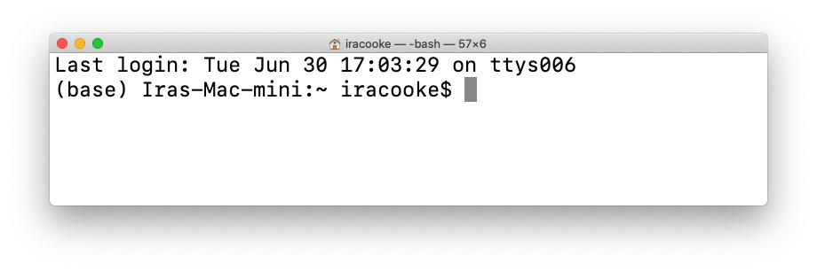
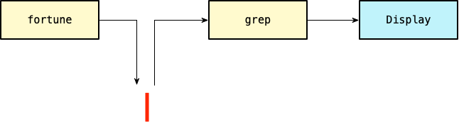

```{r setup, include=FALSE}
knitr::opts_chunk$set(echo = TRUE)
```

## Outline {.build}

### Me talking (45 mins)

General introduction and theoretical background

  > - Background on the command-line
  > - Refresher on Bash basics
  > - Key features of Bash which are useful for Bioinformatics
  
### Exercises
  > - Map paired-end reads to a reference (25 minutes)
  > - Basic functional annotation with BLAST (25 minutes)
  > - Splitting a fasta file into chunks (25)
  > - Designing probes from a variant file (25 minutes)

## What is the command line? {.build}

#### A *text based* user interface



  > - Interprets commands typed by the user
  > - Usually also functions as a programming language

## Common types of command line interface 

### Unix-like shells 
  - Bash (Bourne again shell)
  - sh
  - zsh
  - tcsh

### Windows
  - Powershell 
  - DOS (CMD)

We will focus on **Bash** which is the most common unix-like shell

## Why use the command line {.build}

### Pros

  > - Functionality is highly extensible / interoperable between tools
  > - Workflows are easy to capture (just text)
  > - Wider variety of tools are available
  > - Only way to access most HPC computing resources

### Cons

  > - Functionality is less "discoverable" for novices
  > - Lack of visual metaphors means usage is less intuitive
  > - Graphics can summarise data very effectively  (eg plots, genome browsers, 3D Models)

## Reproducibility {.build}

Working with command-line tools lends itself to reproducibility 

**... BUT ...** 

this won't happen automatically!

### Use tools to enhance reproducibility of your command line work

  > - Document your work with RMarkdown or Jupyter notebooks (both work with `bash`)
  > - Use version control (eg git) to keep track of changes
  > - Keep your scripts organised
  > - Capture dependencies (eg with Docker, conda environments, good note taking)

## Navigating the filesystem

#### Key commands

- `cd` : Change directory
- `ls` : List files in a directory
- `pwd`: Print working directory
- `mkdir` : Create directories
- `cp` / `mv` : Copy / Rename files

Try `cd`, `ls` and `pwd` in your terminal window.

## Filesystem paths

A Path specifies the location of a directory in the filesystem.

A forward slash `/` is used to separate folders in the hierarchy

For example this shows the path to your `HOME` directory

```{bash, eval=FALSE}
cd
pwd
```

Notice how it starts with a `/`.  This means it is an *absolute* path.  An *absolute* path specifies the location from the very top of the hierarchy.  

If a path doesn't start with `/` it is *relative*. A *relative* path specifies a location in relation to the current working directory.

For example in this series of the commands the second call to `cd` is using a *relative* path

```{bash, eval=FALSE}
cd /
cd home/
```

## The shell as a command interpreter

One of the main functions of the shell is that it allows you run commands.  With very few exceptions commands are like any other computer programs.  Each command exists as a file with computer readable instructions somewhere on your computer. By typing the name of the command you are asking your shell to run it. 

Lets work with a command called `fortune`

```{bash}
fortune
```

We can use the `which` command to find out where it is on our computer (ie its path)

```{bash}
which fortune
```

## The shell as a command interpreter

The behaviour of commands can be changed by providing options, or by providing arguments (eg input files). For almost all commands the syntax is;

> command [options] [arguments]

The `fortune` command has a few options.  You can find out all about them by using the `man` command

```bash
man fortune
```

For example the `-m` option can be used to print out all fortunes attributed to Mark Twain

```bash
fortune -m 'Mark Twain'
```

## The shell as a command interpreter

The `ls` command also has options.  For example the `-l` option will list files in *long* format. 

```bash
ls -l
```

The `ls` command can also take an argument.  If you don't provide an argument (eg above) it will list files in the current working directory.  This behaviour can be changed by providing a path to a different directory.  

For example

```bash
ls -l /
```

## The `echo` command

The `echo` command simply evaluates its arguments and prints them back to screen. I will use it often in examples because it is a good way to demonstrate other bash commands.

```{bash}
echo "Hello"
```


## Filename globbing {.build}

Bash has many features designed to allow you to efficiently work with large numbers of files. One of the most powerful is called *Filename globbing*.  This allows you to match specific subsets of files in powerful ways. 

<div class="columns-2">
To demonstrate this, consider a mix of `fastq` and `fasta` files in a directory called `demo`

```{bash, echo=FALSE}
rm -r demo
mkdir -p demo
touch demo/s1_r1.fastq demo/s1_r2.fastq demo/genome.fasta demo/s2_r1.fastq demo/s2_r2.fastq 
```
```{bash}
ls demo
```

Using the special character `*` we can list only files that end with `r1.fastq`

```{bash}
ls demo/*r1.fastq
```

Note that this works because the RHS expands to become two arguments.  It also works with `echo`

```{bash}
echo demo/*r1.fastq
```

</div>

## Glob Pattern Syntax

Bash provides several special characters that can be combined together in glob patterns to allow quite precise matching. 

```{bash, echo=FALSE}
rm -r demo
mkdir -p demo
touch demo/s1_r1.fastq demo/s1_r2.fastq demo/genome.fasta demo/s2_r1.fastq demo/s2_r2.fastq 
```


- `*` Matches any string
- `?` Matches any single character
```{bash}
echo demo/s?_r1.fastq
```
- `[...]` Matches any one of the enclosed characters
```{bash}
echo demo/s[12]_r1.fastq
```

## Output redirection

When you run a command in bash it usually writes its output to one or more of the following locations

  - Standard output (by default this just gets printed to your terminal screen)
  - Standard error (also gets printed to your terminal screen. Usually reserved for errors or warnings)
  - Files (eg the program `FastQC` will generate an `html` file for each `fastq` file it processes)

Often we want to capture the output of a command into a file.  This can be done using the output redirection operator, `>`. 

For example we could capture all quotes attributed to Darth Vader

```bash
fortune -m "- Darth Vader" > vader_quotes.txt
```

Try entering this into your terminal. It should create a file called `vader_quotes.txt`. Use the `head` command to look at the first few lines of this file

```{bash}
head -n 3 vader_quotes.txt
```

## Output redirection

Notice how when we used `>` to redirect output there were still quite a few lines of text printed.  This is the content of *Standard Error*.  

Sometimes we might want to capture standard error as well as standard output, but in this case *Standard Error* is just getting in the way.  We can modify the redirection to specifically redirect *Standard Output* to our file and *Standard Error* to nowhere (`/dev/null`).  We use the numerical designator `2` to refer to *Standard Error*

```bash
fortune -m "- Darth Vader" 2>/dev/null > vader_quotes.txt
```

Another thing to note about `>` is that it always overwrites its output.  To append output to an existing file use `>>`.  

For example if we wanted quotes by Darth Vader and Yoda we could do

```bash
fortune -m "- Darth Vader"  > vader_yoda_quotes.txt
fortune -m "- Yoda"  >> vader_yoda_quotes.txt
```

## Simple Text Searching

The `grep` program is a very flexible and fast way to search text for patterns.  We can use it to count the number of quotes from the previous example. 

<div class="columns-2">

First look at the contents of `vader_quotes.txt`.  Print the entire file to screen using the `cat` command;

```bash
cat vader_quotes.txt
```

Each quote is terminated with a line containing the `%` character.  

If we count only these lines we can count the number of quotes.  Using the `grep` command we can select only these lines;

```{bash}
grep '^%$' vader_quotes.txt
```

If we provide the `-c` option to `grep` it prints a count of the number of lines instead of the matching lines themselves which is what we want.

```{bash}
grep -c '^%$' vader_quotes.txt
```
</div>

## Pipes

So far we have only used single commands on their own.  Bash provides various ways to combine multiple commands together to accomplish larger tasks. One such method is *pipes*. 
The *pipe* operator is `|`.  It sends output from one command to become the input for another.  

For example, in order to count the number of Darth Vader quotes in the `fortune` database we first ran `fortune` and then `grep`.  Up to now we used an intermediate file `vader_quotes.txt` to allow us to combine these two programs. Instead of doing this we can accomplish the entire task in one line with a pipe

```{bash}
fortune -m "- Darth Vader" 2>/dev/null | grep -c '^%$'
```

This is passing data as shown the diagram below



## Cowsay

To illustrate another example of a pipe let's use the `cowsay` command.  This prints text in ascii art form
<div class="columns-2">
```{bash}
cowsay "Hello"
```
<br>
For extra emphasis you can also change the drawing type

```{bash}
cowsay -f dragon "Roaaaarrr"
```
</div>

## More Pipes

Once you have learned the cowsay and fortune commands it is very natural to want to combine them with a pipe. 

Just to make things complete we first need to format our `vader_quotes.txt` database so it can be used by `fortune`

```bash
strfile vader_quotes.txt
```

```{bash}
fortune vader_quotes.txt | cowsay -f vader 
```

# A bioinformatics example {.build}

We have a few more bash concepts to cover.  

- Variables `$`
- Flow control (loops; conditionals)
- Command substition `$()`

To make these more relevant we will use a scenario corresponding to downloading files from a sequencing center.


## Samples and filenames

Imagine that you have new sequencing data available from your service provider. 

They tell you that there are 24 separate files available for download. 

The filenames follow a pattern as illustrated in the figure below.


This corresponds to 12 samples (labelled EM1, EM2, ... EM12).  

Each sample has two files where the `R1` contains forward reads and the `R2` contains reverse reads.

## Variables

Variables are placeholders for information. They occur in all programming languages including bash. 

<div class="columns-2">
For example we could make a variable called sample and assign its value to one of our sample names like this;

```bash
sample="EM1"
```

If we ever want to get that information back we can use the $ operator to retrieve it as follows;

```{bash}
sample="EM1"
echo $sample
```

The `echo` command also allows you to mix variables and fixed strings together for example

```{bash}
sample="EM1"
echo $sample
echo "${sample}_R1.fastq.gz"
```
</div>


## What's the point of variables?

You might be wondering what the point of this is? 

Why would we assign data to a name and then retrieve the same data back? 

The reason this is useful is because it allows us to represent specific instances of the data (eg “EM1”, “EM2”) using the same abstract identifier (eg sample). 

In practical terms, when we reference sample we know that we will get whatever the current value of sample is even if it changes. For example;

<div class="columns-2">
```{bash}
sample="EM1"

echo $sample
```
```{bash}
sample="EM2"

echo $sample
```

</div>

But this still isn’t very useful is it? 

We will see a truly useful use for variables when we come to loops.  Before we get to that we need to cover one more topic.

## Command Substitution

Another way to capture the output of a command or to combine multiple commands together is called *Command Substitution*. 

To illustrate this let's use the `seq` command which creates a sequence of numbers.  For example we can generate numbers 1 to 12 as follows;

```bash
seq 1 12
```

We can capture the output of this by putting our whole command inside an expression like `$(command)`. 

<div class="columns-2">
This can be used to assign the result to a variable
```{bash}
sample_numbers=$(seq 1 12)
echo ${sample_numbers}
```

Or used directly as part of an expression involving multple commands

```{bash}
echo $(seq 1 12)
```
</div>

## Loops / Iteration

Loops allow you to perform the same task repeatedly in different contexts (eg on different files, different names in a list, columns in a table etc etc)

Most programming languages support looping in some form or another. The syntax for a for loop in bash is like this

```bash
for placeholder in <list>
do
  <commands>
done
```

This will take each item in `list` and temporarily assign it to a variable called `placeholder`, The part between do and done can include as many commands as we want and we can refer to the current value of placeholder when running commands. 

## Loops / Iteration

Now let's try using loops to generate a list of sample names so that we can automate downloading our 24 `fastq` files

Our goal is to generate filenames like

> EM[number]_R[12].fastq.gz

<div class="columns-2">
As a start we could do the following;

```{bash}
for sample in EM1 EM2
do
  echo $sample
done
```

But a better way would be to use command substition to generate our iteration list for us;

```{bash}
for sample_num in $(seq 1 2)
do
  echo "EM${sample_num}"
done
```


</div>


## Loops / Iteration

We are getting close.  

<div class="columns-2">

Now we need to deal with the fact that each sample has an R1 and R2 file.  We can easily nest loops to do this;
```{bash}
for sample_num in $(seq 1 2)
do
  for r in R1 R2
    do
    echo "EM${sample_num}_${r}.fastq.gz"
  done
done
```

Only the filename part of the URL changes so we can now generate a complete list of URLs using a variable to hold the base URL.

```{bash}
base_url="https://s3-ap-southeast-2.amazonaws.com/bc3203/EM_10k/"
for sample_num in $(seq 1 2)
do
  for r in R1 R2
    do
    echo "${base_url}EM${sample_num}_${r}.fastq.gz"
  done
done

```
</div>

To finish this off we only need to substitute the `wget` command for `echo`. `wget` is a command that downloads files.  We also need to change our `seq` command to include all 12 samples not just the first 2.

## learning More

Bruce Barnett's Grymoire https://www.grymoire.com/Unix/index.html . This page looks old and unmaintained but it is a gold mine of useful information. It is also quite witty and well written

The bash manual is the definitive reference https://www.gnu.org/software/bash/manual/bash.html
